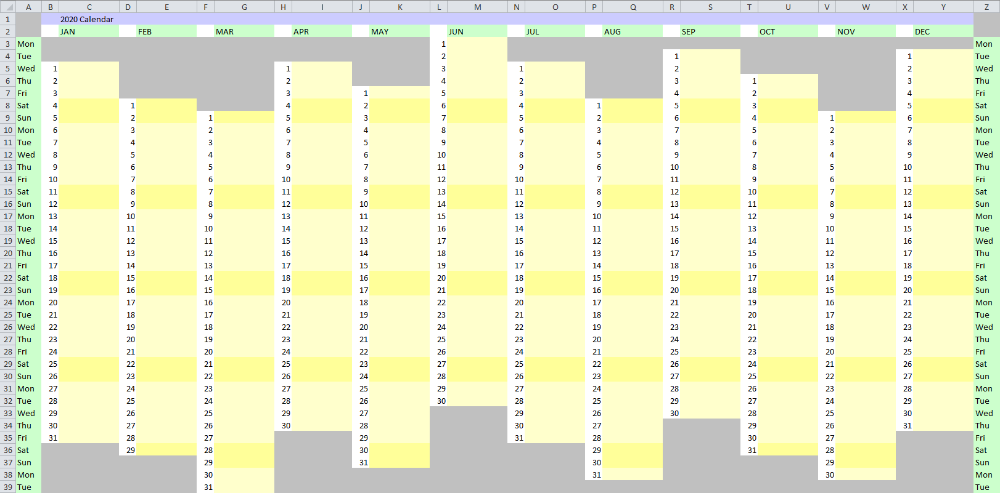

# Calendar Sheet

Calendar Sheet is a Groovy command line utility script which generates spreadsheets like this:



The document can then be edited to visualize the distribution of holidays or other events across the year.

# Usage Instructions

On a computer with [Groovy](https://groovy-lang.org/) installed run:

```bash
groovy CalendarSheet.groovy <4-digit-year> <filename.xlsx> 
```

e.g.

```bash
groovy CalendarSheet.groovy 2020 Calendar2020.xlsx
```

This will generate a new spreadsheet file `Calendar2020.xlsx` in the current folder.